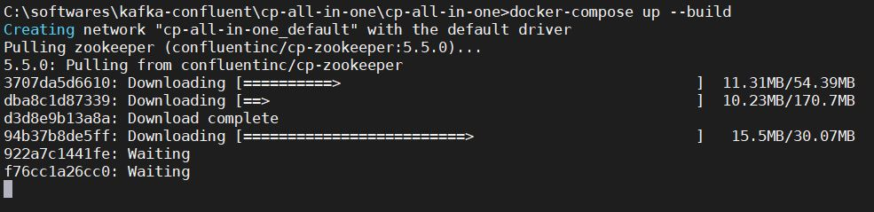
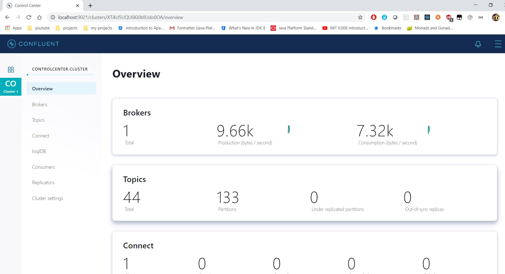

# Kafka Confluent Platform Setup in windows machine Using Docker
* Clone repo - https://github.com/confluentinc/cp-all-in-one.git
```
git clone https://github.com/confluentinc/cp-all-in-one.git
```
* Clones the repo `cp-all-in-one`
* Navigate to `cp-all-in-one/cp-all-in-one` in `cmd` or `powershell`
* Execute command 
```
docker-compose up --build
```

* After starting check the status
```
docker-compose ps
```
```
PS C:\softwares\kafka-confluent\cp-all-in-one\cp-all-in-one> docker-compose ps
```
* Open url - http://localhost:9021
	* Check the `control-center` port using `docker-compose ps` command result


## Reference
* https://nielsberglund.com/2019/06/18/confluent-platform--kafka-for-a-.net-developer-on-windows/
