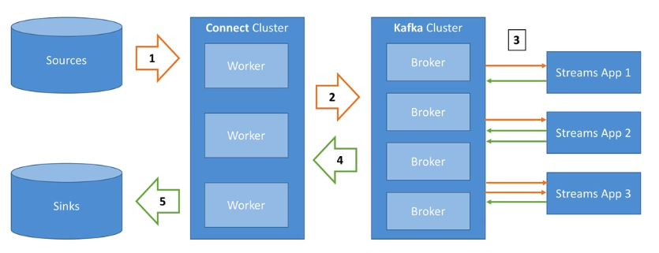

# Kafka Connect Notes
## Two types of kafka connect
* Source connector: Used to pull the data from external data source such as database, file system, elastic search into kafka topic
* Sink connector: Push data from kafka topic to external data sources such as ElasticSearch, database, file system etc

## Some Source Connectors
* FileSystemSourceConnector
* TwitterSourceConnector

## Some Sink connectors
* ElasticSearchSinkConnector
* JDBCSinkConnector

## Why is Kafka Connect?
* Source connect To get data from multiple sources like
	* Databases, JDBC, Couchbase, GoldenGate, SAP, Blockchain, Cassandra, DynamoDB, FTP, IOT, MongoDB, MQTT, SQS, Salesforces, Twitter etc
* Sink connect to send data to multiple sources like
	* S3, ElasticSearch, HDFS, JDBC, DocumentDB, Cassandra, DynamoDB, HBase, MongoDB, Redis, Solr, Splunk, Twitter etc
	
## Kafka Connect and Streams Architecture Diagram
